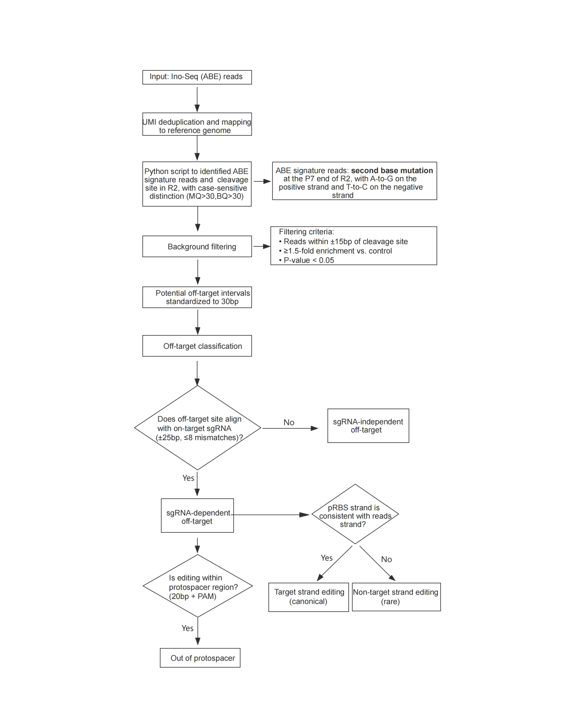

# Ino-seq

**Complete computational workflow for Ino-seq detection of adenine base editor (ABE) off-targets.**

**Release:** `v1.0.0`

Ino-seq (Inosine-sequencing) is an inosine-enrichment sequencing method for
sensitive detection of ABE activity. This repository implements the full core
analysis from paired-end FASTQ files to per-sample site classification,
strand-aware summaries and cohort-level reports.

## Start here

The root-level `inoseq` command is the official user interface. A standard new
analysis follows one path:

```bash
mamba env create -f envs/inoseq.yml
conda activate ino-seq

./inoseq init
# Edit config/inoseq.env, config/samples.tsv and config/pairs.tsv.

./inoseq prepare-reference
./inoseq validate
./inoseq plan
./inoseq submit
./inoseq status
```

`plan` validates the same inputs and prints the resume-aware Slurm dependency
graph without submitting jobs. `submit` is idempotent: it reuses current stages,
submits only incomplete or stale work, and rebuilds the required `afterok`
dependencies automatically.

To deliberately recompute from a boundary:

```bash
./inoseq plan --from-stage module04
./inoseq submit --from-stage module04
```

Supported boundaries are `module01` through `module05`, `qc` and `finalize`.

For a detailed Chinese walkthrough, see
[the end-to-end quick start](docs/QUICKSTART_CN.md).

## One workflow, three execution phases

The five analytical modules form one workflow. The phase names describe job
orchestration only; they are not separate analysis products.

| Execution phase | Analytical modules | Unit of work | Required input | Main result |
|---|---|---|---|---|
| A — sample processing | 01–02 | every experimental or control sample | paired FASTQ | UMI-consensus BAM and ABE signature reads |
| B — paired detection | 03–05 | each experimental/control/sgRNA row | matched Phase A outputs | filtered candidates and final site classification |
| C — reporting | QC and finalizer | complete run | all enabled Phase A/B branches | cohort QC, Excel/TSV summaries and completion status |



Internally, compatibility filenames such as `step01` and `postprocess` remain
in scripts, logs and output directories. In user-facing documentation they map
to Phase A and Phase B, respectively.

## Inputs and pairing model

`./inoseq init` creates three local files from version-controlled templates:

| File | Purpose | Required relationship |
|---|---|---|
| `config/inoseq.env` | reference, output paths, resources and frozen parameters | one file per run |
| `config/samples.tsv` | FASTQ paths for all experimental and control samples | every ID used by `pairs.tsv` must occur here |
| `config/pairs.tsv` | experimental sample, matched control and sgRNA | one row per experimental sample |

Schemas:

```text
# samples.tsv
sample_id<TAB>read1<TAB>read2

# pairs.tsv
sample_id<TAB>control_id<TAB>sgrna
```

Version `1.0.0` supports multiple experimental samples, different or shared
controls, and different or shared sgRNAs. The same experimental `sample_id`
may occur only once in `pairs.tsv`; pooled multi-sgRNA analysis of one sample is
not implemented in this version.

## Frozen analytical decisions

The refactor changes workflow engineering, validation and documentation, not
valid-input calculations or output meanings.

| Decision | v1.0.0 value |
|---|---:|
| cleavage-site window | ±15 bp |
| enrichment versus matched control | fold change ≥1.5 |
| background threshold | raw P <0.05 |
| candidate merging distance | ≤30 bp |
| minimum total candidate cleavage reads | ≥3 |
| sgRNA search window | ±25 bp |
| maximum sgRNA-alignment score | 8 |
| protospacer-neighborhood scan | ±100 bp |

BH-FDR is reported but is not used for filtering. The background comparison is
an unnormalized paired count comparison and must not be described as Fisher's
exact test. Equations, historical compatibility fields and coordinate rules
are frozen in [the algorithm contract](docs/ALGORITHM_CONTRACT.md).

## Completion, resume state and primary results

The workflow is complete only when both of these files exist:

```text
output/INOSEQ_WORKFLOW_COMPLETE
output/QC/full_workflow_status.tsv
```

For reuse, those run-level files are not sufficient by themselves. Every
module and cohort stage also has a small state record under `.inoseq/`. A stage
is reused only when its completion marker, required outputs and reproducibility
fingerprint all agree. The fingerprint covers the relevant inputs, reference,
parameters, upstream state, workflow code and Ino-seq version.

The main user-facing outputs are:

| Result | Location |
|---|---|
| complete run status | `output/QC/full_workflow_status.tsv` |
| sample and library QC | `output/QC/inoseq_qc_summary.tsv` |
| cohort off-target counts | `output/QC/inoseq_offtarget_summary.tsv` |
| cohort strand/protospacer summary | `output/QC/inoseq_strand_summary.tsv` |
| combined Excel report | `output/QC/dependent_target_analysis.xlsx` |
| final site-level table | `output/<sample>/postprocess/offtarget/<sample>_dependent_target.txt` |
| recorded parameters | `output/<sample>/postprocess/run_parameters.tsv` |

All intermediate and final files are defined in
[the complete output contract](docs/OUTPUT_CONTRACT.md).

The `onTarget` label denotes a candidate locus with a zero-mismatch,
substitution-only match to the supplied sgRNA. It is sequence-based and does
not require a separately supplied known genomic coordinate. More than one
perfect genomic match may therefore produce more than one `onTarget` candidate.

## Documentation map

| Need | Read |
|---|---|
| install, configure, submit, monitor or rerun | [Chinese quick start](docs/QUICKSTART_CN.md) |
| understand the five modules and frozen equations | [algorithm contract](docs/ALGORITHM_CONTRACT.md) |
| locate or interpret any result file | [output contract](docs/OUTPUT_CONTRACT.md) |
| understand document roles and terminology | [documentation index](docs/README.md) |

The README and quick start describe how to operate the workflow. The algorithm
and output contracts are the versioned scientific interfaces.

## Automatic resume and controlled recomputation

The same command is used for a new analysis and for recovery after failure:

```bash
./inoseq plan
./inoseq submit
```

Automatic mode resumes each sample at module 01 or 02 and each pair at module
03, 04 or 05. To force a boundary, use:

```bash
./inoseq submit --from-stage module02
./inoseq submit --from-stage module05
./inoseq submit --from-stage qc
./inoseq submit --from-stage finalize
```

`--force` is an alias for `--from-stage module01`. Existing complete outputs
created before state fingerprints were introduced are not trusted silently;
after manual provenance review they can be registered once with
`./inoseq adopt-existing`.

## Reproducibility and tests

```bash
./inoseq test
python -m ruff check workflow tests
```

The automated suite covers background statistics and boundaries, candidate
merging, sgRNA matching and classification, summaries, a synthetic paired
end-to-end analysis, Slurm dependency construction and the unified command.
Optional source regression against the original research scripts is enabled by:

```bash
INOSEQ_LEGACY_DIR=/path/to/original_scripts ./inoseq test
```

## Repository structure

```text
Ino-seq/
├── inoseq       official user command
├── assets/      original workflow figure
├── config/      version-controlled configuration templates
├── docs/        user guide and versioned scientific contracts
├── envs/        reproducible Conda environment
├── tests/       unit, integration and source-regression tests
└── workflow/    internal entry points, modules, QC and validation
```

Runtime configurations, sequencing data, alignments, outputs and Slurm logs are
excluded from version control. The public examples contain no real sample,
sgRNA, server path, account or GitHub username.

## License

MIT License.
